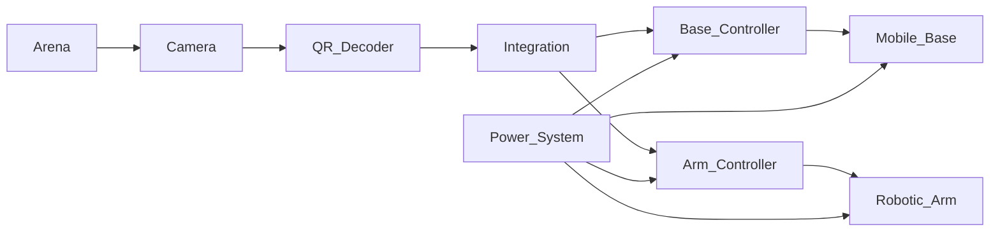
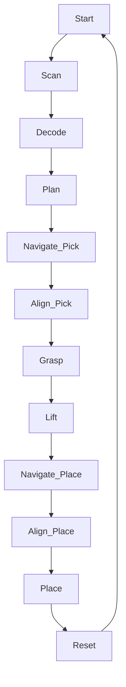

# 🏆 Autonomous Vision-Guided Mobile Manipulator  
### Competition-Grade Modular Pick & Place Robotic System

---

## 1. Executive Summary

This project presents a fully autonomous mobile manipulator designed for structured competition environments.  
The system integrates perception, motion control, robotic manipulation, and system-level coordination into a modular mechatronic architecture.

The robot performs QR-guided object identification and executes precise autonomous pick-and-place operations using an event-driven state machine framework.

---

## 2. Competition Objective

The system must autonomously:

1. Detect QR-coded objects
2. Decode object identity
3. Map object ID to a predefined destination zone
4. Navigate to object location
5. Perform precision alignment
6. Execute grasp sequence
7. Transport object
8. Place object at designated target
9. Return to safe idle state

All operations must satisfy timing, safety, and reliability constraints.

---

## 3. System Architecture

The platform follows a layered modular architecture:

- 📷 Perception Layer  
- 🧠 Integration Layer  
- ⚙ Control Layer  
- 🔌 Electrical & Power Layer  
- 🏗 Mechanical Structure Layer  

---

## 4. High-Level System Block Diagram



---

## 5. Perception Layer

### 5.1 Camera Module
Responsible for:
- Frame acquisition
- Resolution configuration
- Exposure control
- Stable imaging under competition lighting

### 5.2 QR Detection Module

Processing Pipeline:

1. Frame capture  
2. Image preprocessing  
3. QR detection  
4. Payload decoding  
5. Payload validation  
6. Data transmission to integration layer  

Example decoded message:

QR,OBJ_A3,ZONE_2

---

## 6. Integration Layer (System Brain)

The integration layer coordinates all subsystems through an event-driven state machine.

### Responsibilities:
- Mission planning
- State transitions
- Retry policies
- Timeout management
- Fault detection
- Emergency handling

---

## 7. Mission Flow



---

## 8. State Transition Overview

| Current State | Event | Action | Next State |
|---------------|--------|--------|------------|
| IDLE | Start | Activate camera | SCAN |
| SCAN | QR detected | Capture frame | DECODE |
| DECODE | Valid QR | Plan mission | NAVIGATE |
| NAVIGATE | Target reached | Stop base | ALIGN |
| ALIGN | Aligned | Lock base | PICK |
| PICK | Grip OK | Lift object | TRANSPORT |
| TRANSPORT | Destination reached | Stop base | PLACE |
| PLACE | Release complete | Reset arm | IDLE |
| ANY | Fault detected | Safe stop | ERROR |

Detailed implementation available in `integration/state-machine/`.

---

## 9. Control Layer

### 9.1 Base Controller
- Motor PWM control
- Holonomic motion execution
- Encoder feedback
- Obstacle avoidance

### 9.2 Arm Controller
- Multi-DOF servo positioning
- Gripper actuation
- Pick-and-place sequencing
- Transport pose control

---

## 10. Communication Protocol

Structured message-based communication between modules.

### Example Messages

Vision → Integration  
QR,OBJ_A3,ZONE_2  

Integration → Base  
NAV,ZONE_2  

Base → Integration  
BASE_REACHED,PICK_POINT  

Arm → Integration  
ARM_GRIP_OK  

Heartbeat monitoring ensures communication integrity.

---

## 11. Electrical & Power System

Includes:
- Power distribution network
- Motor drivers
- Protection circuits
- Battery management
- Power budget analysis

---

## 12. Mechanical System

Includes:
- Chassis design
- Robotic arm structure
- Mounting interfaces
- Structural validation
- Bill of Materials (BOM)

---

## 13. Testing Strategy

- Unit-level module testing
- Integration validation
- Timeout verification
- Retry logic validation
- Fault injection testing
- Full mission rehearsal

---

## 14. Safety Strategy

- Emergency stop state
- Communication timeout detection
- Retry thresholds
- Controlled shutdown logic
- Motor stall monitoring

---

## 15. Repository Structure

```
docs/
hardware/
   mechanical/
   electrical/
firmware/
   base-controller/
   arm-controller/
   communication/
perception/
   camera-config/
   qr-detection/
integration/
   state-machine/
```

---

## 16. Engineering Highlights

- Modular plug-and-play architecture
- Event-driven state machine integration
- QR-guided autonomous decision logic
- Clear separation of perception, control, and actuation
- Structured system documentation
- Competition-oriented robustness design

---

## 17. Project Status

- Requirements defined  
- Functional architecture completed  
- State machine designed  
- Communication protocol structured  
- Integration testing in progress  

---

Autonomous Robotics Competition Project  
Mechatronic System Design & Integration
